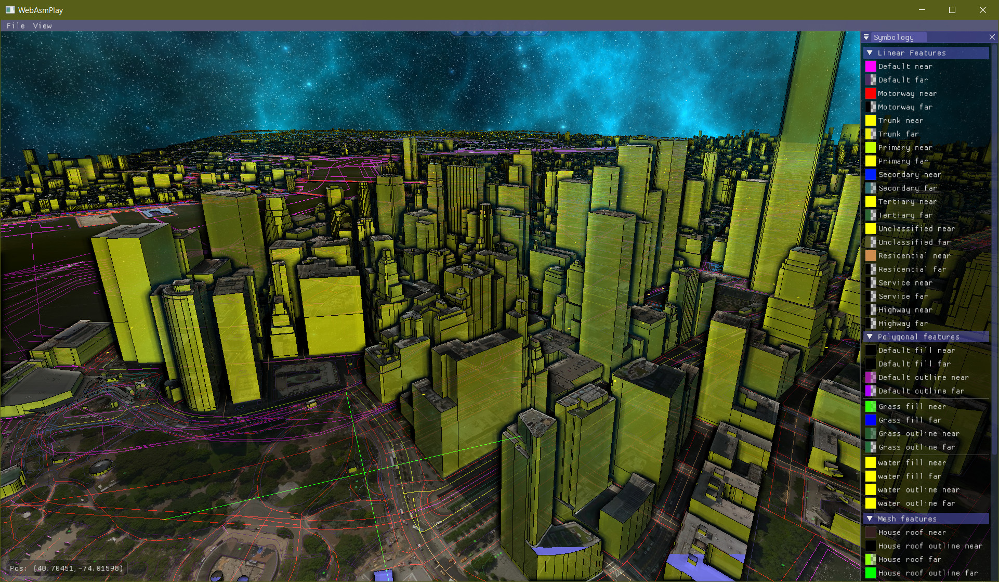

----------------------
WebAsmPlay
----------------------

WebAsmPlay was initially developed to evaluate web application development using Emscripten.
At the time of writing the Emscripten part is not working. Hopefully in the future it will be. 
To see the last Emscripten build working: https://trailcode.github.io/ZombiGeoSim/index.html Be patient to let it load.
Hold down the "alt" key and move the mouse to pan. Hold down the "shift" key and move the mouse to rotate the camera.

<iframe width="560" height="315"
src="https://www.youtube.com/embed/MUQfKFzIOeU" 
frameborder="0" 
allow="accelerometer; autoplay; encrypted-media; gyroscope; picture-in-picture" 
allowfullscreen></iframe>

The current goal of this project is morphing into a Real-Time Strategy game using
OpenSteer (http://opensteer.sourceforge.net/) and OpenStreetMap (https://www.openstreetmap.org)
To provide a starting point for non player character(NPC) zombie bots who roam Open Street Map cities.
NPC positions will be calculated on a server and the client application running in the browser or natively
can query bot positions and states for the given viewport. The server will also be responsible for geometry
generalization, bot AI, navigation graphs generated from Open Street Map data and state persistence.
In the near future this project is going to be renamed to ZombieGeoSim. 

### Features

* Ability to run the client in a supported web browser or as a native client. 
    * Object Picking where the picked object under the mouse cursor is highlighted and it's attributes are displayed.
    * Skybox Renderer.
    * Path finding over linear features.
    * Autonomous zombies wonder on paths while steering to avoid each other.
    * Multiple camera modes: TrackBall and zombie tracking camera mode.
    * User definable symbology color rendering supporting transparency for both fill and outlines.
        * Camera near and far symbology can be defined for each attribute allowing for interpolated symbology blending proportional to object to camera distance.
    * Ability to render 3D buildings.
    * Project BingMaps raster tiles over scene. 
    * Create and play camera animation tracks.

* Geometry Server
    * ESRI Shapefile and OpenStreetMap XML GIS formats with linestring and polygon ingestion along with attribution.
    * Fast custom attributed transport protocol.
    * Ensures linear feature topology correctness. Breaks linestrings at intersections and connections. Removes overlapping linestrings.

### Sources

Some third party dependencies are built into the WebAsmPlay source tree to make emscripten compilation easer
and allow C++ 17 compilation:  
* Geos: https://trac.osgeo.org/geos
* OpenSteer: http://opensteer.sourceforge.net
* Ctpl: https://github.com/vit-vit/CTPL
* Glm: https://glm.g-truc.net/0.9.9/index.html
* GLUTessellator: https://github.com/mbebenita/GLUTesselator
* Native Dear Imgui: https://github.com/ocornut/imgui [Docking branch]
* Imgui-addons: https://github.com/wflohry/imgui-addons
* Emscripten Dear Imgui: https://github.com/greggman/doodles/tree/master/glfw-imgui
* Websocketpp: https://github.com/zaphoyd/websocketpp
* Histogram: https://github.com/HDembinski/histogram
* SimpleJSON: https://github.com/MJPA/SimpleJSON

#### Building

The build system is based on CMake. 

